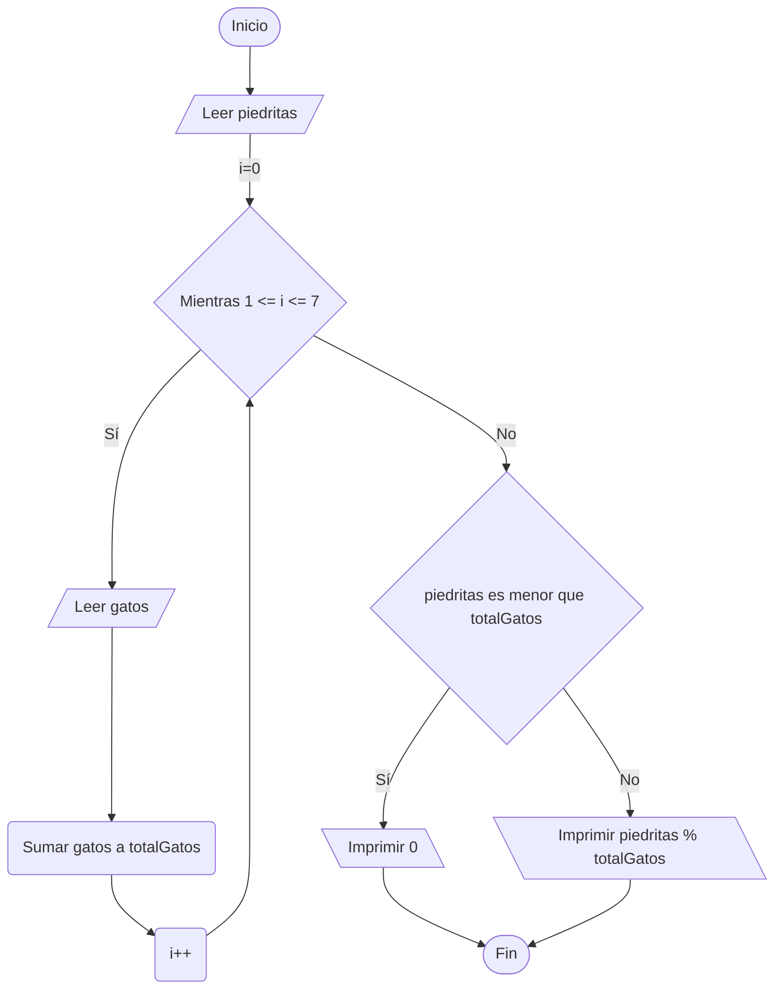

https://www.cpcjudge.com/problem/dopa

# C. Dopamina
Autor: Ignacio_benq

## Descripción

Maullín andaba perdido en el bosque recolectando piedritas brillantes, cuando de pronto una manada de lobos le saltó encima. 
Corrió como nunca y de milagro escapó.

Cuando se dio cuenta de que estaba a salvo, le llegó un subidón de dopamina, porque es más gato que bonito.

Después de tanto tiempo caminando, terminó en los famosos siete puentes de Königsberg, y en cada puente vio grupitos de gatos jugando.

Maullín quiere repartir sus piedritas equitativamente entre todos los gatos de los 7 puentes (numerados del $1$ al $7$) y guardarse de recuerdo las que sobren.

Si no es suficiente darles a todos por lo menos una piedra, aún así repartirá todas las piedras (aunque algunos gatos se queden sin piedras) por lo que no le sobrará nada.

## Entrada

En la primera línea, un entero $p$ $(1 \leq p \leq 10^{3})$, la cantidad de piedritas que recolectó Maullín.
En la segunda línea, siete enteros $a$, $b$, $c$, $d$, $e$, $f$, $g$ $(1 \leq a, b, c, d, e, f, g \leq 100)$, la cantidad de gatos en cada unos de los $7$ puentes.
Se garantiza que el reparto se hace usando **división entera**: cada gato recibe la misma cantidad exacta de piedritas, y las que no alcanzan a repartirse se quedan como sobrantes.

## Salida

Imprime un solo entero, la cantidad de piedritas que le sobran a Maullín después de repartir.

## Ejemplos

### Entrada
```
29
7 3 1 4 2 6 5
```
### Salida
```
1
```

### Entrada
```
100
7 7 7 7 7 7 7
```
### Salida
```
2
```

### Entrada
```
14
2 2 2 2 2 2 2
```
### Salida
```
0
```

## Notas

- En el primer ejemplo, hay $28$ gatos en total entre los siete puentes. A cada gato le tocan $1$ piedrita.
- En el segundo, hay $49$ gatos en total y a cada gato le tocan $2$ piedritas.
- En el tercero hay $14$ gatos en total y a cada uno le toca exactamente $1$ piedrita.

## Temas identificados
### Matemáticas
- Módulo

### Programación
- Ciclos
- Condicionales
- Acumuladores

## Propuesta de solución

Al leer la descripción se puede entender que las piedritas se van a repartir entre todos los gatos independientemente de en que puente se encuentren, por lo que es innecesario mantener a los gatos como un arreglo de puentes, y se vuelve más conveniente tener la cantidad total de gatos en un solo dato.

Cuando se menciona que si no hay suficientes piedritas para repartirles a todos, aún así las reparte hasta quedarse sin ninguna, quiere decir que si la cantidad de piedritas es menor a la cantidad total de gatos, entonces siempre le sobrarán $0$ piedritas.

Si la cantidad de piedritas es mayor o igual que la cantidad total de gatos y al mencionarse que solo se quiere lo que sobra, se entiende que debe usarse la operación **módulo** (%), que es el residuo de una división, de forma que si dividimos $100/49$, el resultado es $2$, y el residuo es $2$. Así podemos encontrar cuántas piedritas sobran tras realizar la división entre las piedritas y el total de gatos.

## Implementación

Para leer la entrada de los $7$ puentes se usa un ciclo que se repita $7$ veces pues se sabe que siempre hay $7$ puentes, se puede usar un ciclo for, y para cada iteración se acumula la cantidad de gatos en un tipo de variable llamada **variable acumuladora** para encontrar la cantidad total de gatos.

Si piedritas es menor que el total de gatos, imprimir $0$.

Si piedritas es mayor o igual que el total de gatos, encontrar la cantidad de piedritas que sobran tras repartir equitativamente entre todos los gatos se debe encontrar el **módulo** de operación $piedritas / totalGatos$, con la siguiente expresión: $piedritas$ % $totalGatos$



### C++

```cpp
#include <bits/stdc++.h>

using namespace std;

int main() {

    int piedritas, totalGatos = 0;
    cin >> piedritas;

    for (int i = 0; i < 7; i++) {
        int gatos;
        cin >> gatos;
        totalGatos += gatos;
    }

    if (piedritas < totalGatos) {
        cout << 0;
    } else {
        cout << piedritas % totalGatos;
    }

    return 0;
}
```
