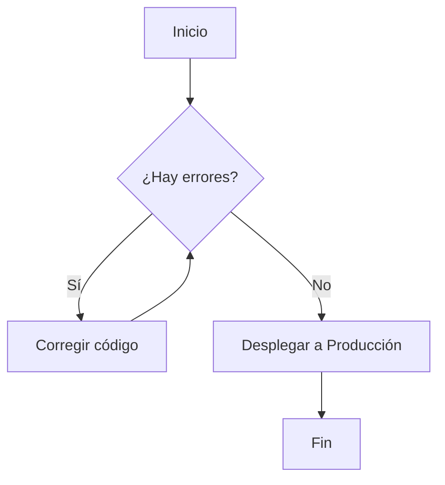

Descripción</h3>

<em>"Para acordarme de mí, yo me necesito ahí"</em>

 
Una de las mejores partes de la primavera, son las vacaciones. Debido a esto, Felipe por fin puede regresar a su pueblo, y dispuesto a esto él se sube a su camión para ir por un viaje de \(46\) kilómetros. Como consecuencia al cansancio, Felipe se duerme al instante de sentarse, por lo que te pide amablemente que lo despiertes cuando solo queden \(4\) kilómetros para llegar.

Dada la distancia en metros, si aún le quedan \(4,000\) metros o más para llegar a su pueblo imprime <em>"Zzz"</em>, si le quedan menos de \(4,000\) metros imprime <em>"Ya merito"</em>.

 

<h3>Entrada</h3>

Un entero \(N\) \((1 \leq N \leq 46,000)\), representando la distancia actual que Felipe ha recorrido en metros.

 

<h3>Salida</h3>

El texto correspondiente a la distancia.

 

<h3>Ejemplo</h3>

<h4>Entrada</h4>

<pre><code>15445</code></pre>
<h4>Salida</h4>

<pre><code>Zzz</code></pre>

 

<h4>Entrada</h4>

<pre><code>44575</code></pre>
<h4>Salida</h4>

<pre><code>Ya merito</code></pre>

 

<h4>Entrada</h4>

<pre><code>42000</code></pre>
<h4>Salida</h4>

<pre><code>Zzz</code></pre>

 

<h3>Notas</h3>

En el primer caso, a Felipe todavía le quedan \(30,555\) metros para llegar.

En el segundo caso, solo faltan \(1,425\) metros, por lo que ya merito llega.

En el tercer caso, quedan exactamente \(4,000\) metros, por lo que todavía se puede dormir... aunque sea un metro más.

