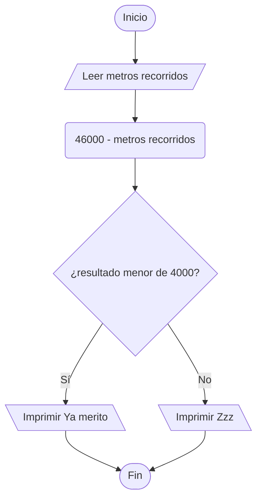

https://www.cpcjudge.com/problem/camion

# D. Camión
### Autor: Soria

## Descripción
*"Para acordarme de mí, yo me necesito ahí"*

Una de las mejores partes de la primavera, son las vacaciones. Debido a esto, Felipe por fin puede regresar a su pueblo, y dispuesto a esto él se sube a su camión para ir por un viaje de $46$ kilómetros. Como consecuencia al cansancio, Felipe se duerme al instante de sentarse, por lo que te pide amablemente que lo despiertes cuando solo queden $4$ kilómetros para llegar.

Dada la distancia en metros, si aún le quedan $4,000$ metros o más para llegar a su pueblo imprime **"Zzz"**, si le quedan menos de $4,000$ metros imprime **"Ya merito"**


## Entrada
Un entero $N$ $(1 \leq N \leq 46,000)$, representando la distancia actual que Felipe ha recorrido en metros.

## Salida
El texto correspondiente a la distancia.

## Ejemplos

### Entrada
```
15445
```
### Salida
```
Zzz
```

### Entrada
```
44575
```
### Salida
```
Ya merito
```

### Entrada
```
42000
```
### Salida
```
Zzz
```

## Notas
- En el primer caso, a Felipe todavía le quedan $30,555$ metros para llegar.
- En el segundo caso, solo faltan $1,425$ metros, por lo que ya merito llega.
- En el tercer caso, quedan exactamente $4,000$ metros, por lo que todavía se puede dormir... aunque sea un metro más.

## Temas identificados
### Programación
- Condicionales

## Propuesta de solución
### Autor: Jordan

Según la descripción el viaje siempre tiene $46$ kilómetros sin importar la entrada, así que podemos restar a $46000$ el número de entrada, pues se expresa en metros, el resultado de la resta debe ser estrictamente menor que $4000$ decir **"Ya merito"**, en caso contrario será **"Zzz"**

## Implementación

Leer la entrada de metros recorridos y hacer la operación $46000-metrosRecorridos$, si es menor a $4000$, imprimir **"Ya merito"**, en caso contrario imprimir **"Zzz"**



### C++
```cpp
#include <bits/stdc++.h>

using namespace std;

int main() {
    int metrosRecorridos;
    cin >> metrosRecorridos;

    if (46000 - metrosRecorridos < 4000) {
        cout << "Ya merito";
    } else {
        cout << "Zzz";
    }

    return 0;
}
```
