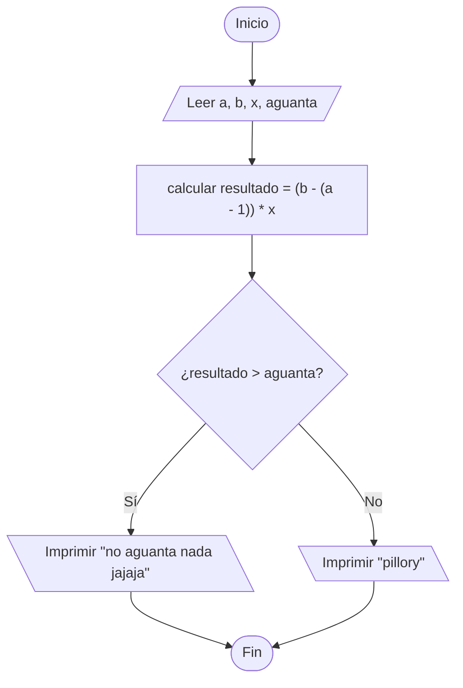

https://www.cpcjudge.com/problem/tiempos

# F. En mis tiempos

## Descripción
Maullín ya andaba haciendo amigos, cuando un gato le contó muy emocionado que un humano llamado Euler había resuelto un acertijo famoso sobre estos puentes. Maullín no tenía idea de quién era ese Euler ni de qué acertijo le hablaban. Los demás gatos al verlo se ofendieron y empezaron a aventarle piedras brillantes desde los puentes.

Desde el segundo $a$ hasta el segundo $b$ le tiraron piedras. En cada segundo le tiraron $x$ piedras, porque los gatos se organizaron para burlarse mejor.

Maullín solo aguanta $n$ piedras, por lo que si le tiran más de esa cantidad Maullín va a llorar.

## Entrada
En la primera línea, dos enteros $a$ y $b$ $(1 \leq a \leq b \leq 1000)$, el segundo en el que empiezan y el segundo en el que terminan de aventarle piedras, respectivamente.</p>

En la segunda línea, un entero $x$ $(1 \leq x \leq 1000)$, la cantidad de piedras que le tiran en cada segundo.

En la tercera línea, un entero $n$ $(1 \leq n \leq 10^{5})$, la cantidad de piedras que Maullín aguanta antes de llorar.

## Salida
Imprime, "no aguanta nada jajaja" si la cantidad de piedras sobrepasa lo que maullin aguanta, de lo contrario "pillory" si todavia aguanta.

## Ejemplos

### Entrada
```
1 5
3
20
```
### Salida
```
pillory
```

### Entrada
```
2 6
4
10
```
### Salida
```
no aguanta nada jajaja
```

### Entrada
```
3 3
7
7
```
### Salida
```
pillory
```

## Notas
En el primer ejemplo le tiran piedras desde el segundo $1$ hasta el $5$, son $5$ segundos y cada segundo le caen $3$ piedras, en total $15$ piedras. Como Maullín aguanta $20$, todavía la libra.

En el segundo caso le tiran desde el segundo $2$ hasta el $6$, son $5$ segundos por $4$ piedras cada uno, total $20$ piedras. Solo aguanta $10$, así que no aguanta nada jajaja.

En el tercer caso solo le tiran en el segundo $3$, le caen $7$ piedras y aguanta justo $7$, así que pasa.

## Temas identificados
- Condicionales

## Propuesta de solución
Para saber si aguanta debemos comparar los golpes que ha recibido durante una cantidad de segundos contra los golpes que puede aguantar. Para encontrar la cantidad de segundos que han pasado podemos hacer la operación:

$últimoSegundo - (primerSegundo - 1)$,

de forma que se incluya a ambos extremos en el resultado. Luego multiplicamos la cantidad de segundos por la cantidad de piedras que lanzan por segundo, el resultado hay que compararlo con la cantidad de daño que aguanta, si es mayor que lo que aguanta la solución es **"pillory"**, en caso contrario la solución es **"no aguanta nada jajaja"**.

## Implementación



### C++


```cpp
#include <bits/stdc++.h>

using namespace std;

int main() {
    int a, b, x, aguanta;
    cin >> a >> b >> x >> aguanta;
    if (((b - (a - 1)) * x) > aguanta) {
        cout << "no aguanta nada jajaja";
    } else {
        cout << "pillory";
    }

    return 0;
}
```
