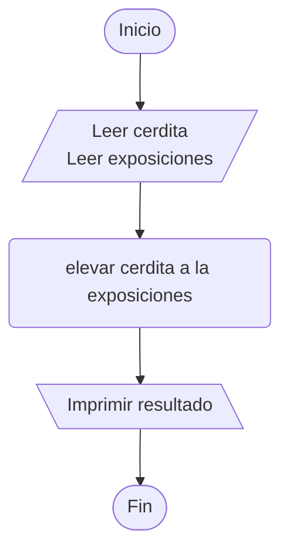

https://www.cpcjudge.com/problem/cerdita

# J. cerdita
### Autor: xenredda

## Descripción

Melisa, una estudiante de artes visuales obsesionada con la primavera, presentó recientemente su nueva obra titulada **cerdita** en una exposición cultural organizada por el gobierno estatal. La pieza rápidamente llamó la atención por su estética caótica y sus colores fosforescentes llamativos a la vista.

El éxito de la exposición fue tan grande que varias galerías comenzaron a solicitar reproducciones del cuadro para futuras exhibiciones primaverales. Emocionada por la recepción de su obra, Melisa decidió calcular cuántas copias existirán después de varias exposiciones consecutivas.

Melisa cuenta inicialmente solo con su **obra original** (1 pieza). En cada exposición que se realiza, la demanda es tan alta que la cantidad total de cuadros existentes se multiplica exactamente por un factor de $C$. Por lo tanto, la cantidad final de obras después de varias exposiciones se calcula mediante la expresión: 

$C^E$

donde $E$ representa la cantidad de exposiciones realizadas.
Tu tarea es ayudar a Melisa a calcular cuántas copias de **cerdita** existirán al finalizar todas las exposiciones.

## Entrada
La entrada consiste en una sola línea con dos números enteros:
$C(1 \le C \le 10)$, el factor por el cual se multiplican las obras en cada exposición.
$E(0 \le E \le 10)$, la cantidad de exposiciones realizadas.

## Salida
Imprime un único número entero correspondiente al resultado de $C^E$.

## Ejemplos

### Entrada
```
2 3
```
### Salida
```
8
```

### Entrada
```
5 2
```
### Salida
```
25
```

### Entrada
```
7 0
```
### Salida
```
1
```

## Notas
- En el primer ejemplo, se multiplica por un factor de $2$ durante $3$ exposiciones, así que el resultado es $2^3 = 8$.

- En el segundo ejemplo, la cantidad total de obras crece a $5^2 = 25$ copias finales del cuadro.

- En el tercer ejemplo, al haber $0$ exposiciones, no se ha hecho ninguna reproducción, por lo que lógicamente solo existe la obra original de Melisa $(7^0 = 1)$.

## Temas identificados
### Matemáticas
- Potencias
- Leyes de exponentes

## Propuesta de solución
### Autor: Jordan

En la descripción se especifica que la entrada es $C$ $E$, también se menciona la expresión $C^E$, y al revisar los **Ejemplos** se puede ver que la solucion será elevar $C$ a la $E$ potencia.

Conviene recordar la propiedad **exponente cero** de las leyes de los exponentes que dice que $a^0=1, a\neq0$

## Implementación



### C++

Respecto a los límites hay que notar que $C$ tiene un valor entre 1 y 10, mientras que $E$ tiene un valor entre 0 y 10, por lo que, en el peor de los casos, la entrada será 10 10, representado como $10^{10}$, valor que desborda una variable entera **int** de 32 bits, cuyo máximo valor es $10^9$, por lo que se necesita una variable entera de 64 bits, denominada **long long** para poder guardar el valor resultante de la operación.

En cuanto al funcionamiento de **pow**, perteneciente a la librería **cmath** que ya se encuentra incluida en la librería **bits/stdc++.h**, hay que notar que si se imprime directamente el resultado de la operación y tiene 7 dígitos o más, imprimirá algo similar a $1.0e+06$, que difiere con los casos de prueba, por lo que el juez virtual indicará WA (wrong answer), aún cuando el resultado sea correcto. Por lo que es necesario usar una varible intermedia de tipo **long long** que almacene el resultado, para después imprimir dicha variable.

```cpp
#include <bits/stdc++.h>

using namespace std;

int main() {
    long long cerdita, exposiciones;
    cin >> cerdita >> exposiciones;
    long long resultado = pow(cerdita, exposiciones);
    cout << resultado;

    return 0;
}
```
