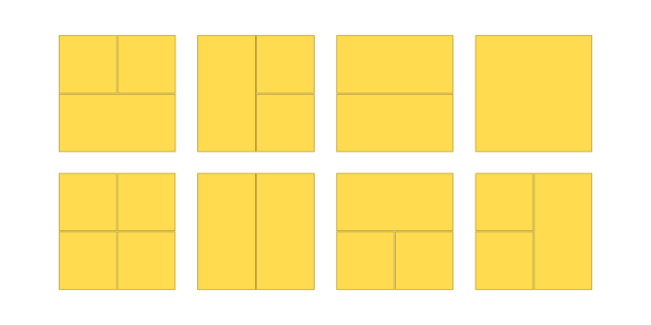

https://www.cpcjudge.com/problem/panal

# L. Panal
### Autor: Soria

## Descripción

*"¿Nos harán trabajar hasta la muerte?... Esa es la idea."*

Honey debe planear la reconstrucción del panal de su colmena, es una ardua tarea, puesto que la reina ha pedido construir los panales de forma diferente a la convencional. La idea planteada trata de construir una torre de longitud $2$ y altura $N$ la cual sea conformada por únicamente rectángulos de cualquier tamaño, siempre y cuando la altura y el ancho sean enteros.

El proyecto ha sido todo un éxito, otros panales del bosque han averiguado esta nueva forma de construcción y desean que Honey haga lo mismo para sus panales, pero hay un problema, ellos quieren tener un diseño único. Por lo que ahora es necesario saber cuántos panales de las medidas proporcionadas es posible hacer. Irónicamente son demasiados, por lo que es necesario dar la respuesta en módulo $10^9 + 7$.

## Entrada

Un enterno $T$ $(1 \leq T \leq 100)$ representando el número de casos.
<p>Seguido de $T$ enteros $N$ $(1 \leq N \leq 10 ^ 6)$ indicando la altura que tendrán los panales para el caso $i$.

## Salida
$T$ enteros $X$ módulo $10^9 + 7$, el número de formas posibles para construir el panal para el caso $i$.

## Ejemplos

### Entrada
```
3
2
6
1337
```
### Salida
```
8
2864
640403945
```

## Notas

En el primer caso, estas son todas las posibles formas de construir el panal de altura $2$:




## Temas identificados


## Propuesta de solución


## Implementación


```mermaid

```

### C++

```cpp

```

