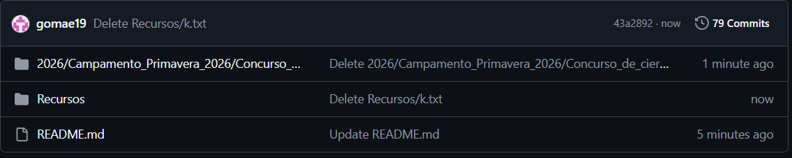
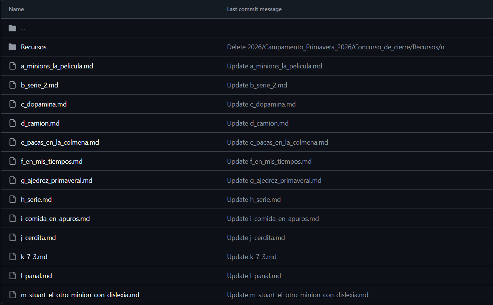

# CPC_UAEH

Repositorio oficial de documentación del **Club de Programación Competitiva (CPC)** de la **Universidad Autónoma del Estado de Hidalgo (UAEH)**.
https://cpcjudge.com/

## Descripción

CPC_UAEH es una colección de documentación técnica sobre problemas de programación competitiva. Cada documento describe el análisis, razonamiento y solución de un problema específico, incluyendo implementaciones de referencia cuando es necesario.

El objetivo principal de este repositorio es preservar el conocimiento generado dentro del club y servir como material de consulta para futuros participantes.

La programación competitiva suele involucrar problemas cuya solución no es evidente de manera intuitiva. Muchas veces, comprender el enfoque correcto requiere conocer algoritmos, estructuras de datos o técnicas específicas. Este repositorio busca reducir esa barrera proporcionando explicaciones accesibles y documentadas.

## Motivación

A medida que los miembros del club adquieren experiencia resolviendo problemas, se genera una gran cantidad de conocimiento técnico que puede perderse con el tiempo.

Este repositorio fue desarrollado para:

* Preservar soluciones y conocimientos adquiridos por los integrantes del club.
* Facilitar el aprendizaje de nuevos miembros.
* Proporcionar una referencia permanente para problemas previamente resueltos.
* Evitar la dependencia de una sola persona para explicar una solución.
* Crear una base de conocimiento reutilizable para futuras generaciones del CPC.

## Contenido

El repositorio está organizado en carpetas según el año, evento, concurso o temática correspondiente.

Cada archivo Markdown puede incluir:

- Link al problema en la página.
- Descripción del ploblema.
- Entradas.
- Salidas.
- Ejemplos.
    - Entradas.
    - Salidas.
- Notas.
- Temas identificados.
    -Programación.
    -Matematicas.
- Propuesta de solución.
- Implementación.
    - Diagrama de flujo
    - Codigo.
        - C++.
        - Java.
        - Kotlin.
        - Python.

## Lenguajes Utilizados

Las soluciones documentadas pueden encontrarse en distintos lenguajes de programación, incluyendo:
- C++
- Java
- Kotlin
- Python

## Uso

Este repositorio no corresponde a una aplicación ejecutable.
Los documentos están escritos en formato Markdown (`.md`) y pueden consultarse directamente desde GitHub o mediante cualquier visor compatible con Markdown.

Cuando una solución incluye código fuente, este puede copiarse y ejecutarse en el entorno correspondiente:

- IDEs para C++
- IDEs para Java
- IDEs para Kotlin
- IDEs para Python

La forma de compilación o ejecución dependerá del lenguaje utilizado en cada problema.

La entrada y salida de datos están preparadas para el juez virtual.

## Contribuciones

Las contribuciones de miembros del CPC son bienvenidas.

Al agregar documentación nueva se recomienda:

1. Explicar claramente la idea principal de la solución.
2. Justificar el algoritmo utilizado.
3. Incluir análisis de complejidad cuando sea relevante.
4. Mantener un formato consistente con el resto del repositorio.
5. Verificar que el código incluido sea correcto, legible y validado por el juez virtual de cpcjudge.

## Participantes

- [@gomae19](https://github.com/gomae19)
- [@jordansosa1](https://github.com/jordansosa1)
- [@edcrvl](https://github.com/edcrvl)

## Sobre el Club

El Club de Programación Competitiva (CPC) de la Universidad Autónoma del Estado de Hidalgo es una comunidad dedicada al estudio de algoritmos, estructuras de datos y resolución de problemas de programación competitiva.

Este repositorio forma parte del esfuerzo del club por documentar y compartir conocimiento entre sus integrantes.

## Licencia

Salvo que se indique lo contrario, el contenido de este repositorio tiene fines educativos y académicos, sin ánimos de lucro.

